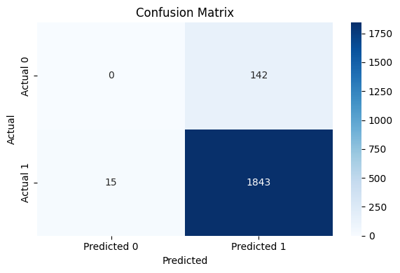

# Payment Failure Prediction using Machine Learning

## Project Overview

This project predicts whether a payment transaction will succeed or fail using Machine Learning techniques. The objective is to help fintech companies identify transaction failure patterns, reduce failed transactions, and improve customer experience.

---

## Business Problem

Payment failures negatively impact merchants, customers, and overall revenue. By analyzing transaction data and predicting transaction outcomes, businesses can proactively identify risk factors and improve payment success rates.

---

## Tools & Technologies

* Python
* Google Colab
* Pandas
* NumPy
* Scikit-Learn
* Matplotlib
* Machine Learning

---

## Dataset Features

* Transaction Amount
* Payment Method
* Bank Name
* Merchant Category
* Device Type
* City
* Transaction Status (Target Variable)

---

## Data Preprocessing

* Handled missing values
* Encoded categorical variables
* Feature selection
* Train-test split (80:20)

---

## Machine Learning Model

### Model Used

* Random Forest Classifier

### Objective

Predict whether a transaction will:

* Success
* Failed

---

## Evaluation Metrics

* Accuracy
* Precision
* Recall
* F1 Score

> Update this section with your actual model results.

Example:

* Accuracy: XX%
* Precision: XX%
* Recall: XX%
* F1 Score: XX%

---

## Confusion Matrix

The confusion matrix shows the model's prediction performance across successful and failed transactions.

---

## Feature Importance

The chart below highlights the most influential factors affecting transaction outcomes.

---

## Key Insights

* Payment method significantly impacts transaction success.
* Certain banks exhibit higher failure rates.
* Device type influences transaction outcomes.
* Merchant category contributes to transaction risk patterns.
* Transaction amount impacts prediction probability.

---

## Business Impact

This solution can help fintech companies:

* Reduce transaction failures
* Improve customer experience
* Increase merchant success rates
* Improve operational efficiency
* Support data-driven decision-making

---

## Repository Structure

payment-failure-prediction-ml/

├── payment_failure_prediction.ipynb

├── payment_operations_analytics_dataset.csv

├── feature_importance.png

├── confusion_matrix.png

├── README.md

---

## Future Improvements

* XGBoost Implementation
* Hyperparameter Tuning
* Real-time Transaction Monitoring
* Fraud Detection Integration

---

## Author

Sai Shashank R

MBA Business Analytics | Data Analyst | Business Analyst

Python | SQL | Power BI | Machine Learning

